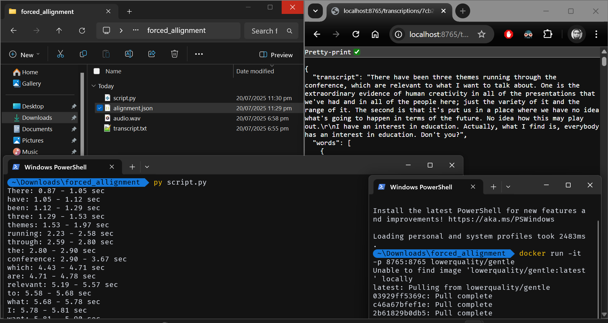

# 🧩 Forced Alignment using Gentle

## 📌 What is Forced Alignment?

> Forced alignment is the process of automatically synchronizing a written transcript with its corresponding audio. It assigns precise timecodes to each word or phoneme in the transcript, enabling accurate word-level alignment. This technique is widely used in linguistics, speech research, subtitle generation, and speech recognition systems.

This repository provides a simple and effective guide for aligning English audio with its transcript using the [Gentle](https://github.com/lowerquality/gentle) forced aligner.

---

## 📖 Story Behind This Repo

While working on forced alignment of audio and transcript, I explored many tools like `whisperX`, `whisper-fast`, `aeneas`, and others. Unfortunately, they either produced incorrect results, had version compatibility issues, complex installation process or failed during installation.

Eventually, I discovered **Gentle**, a robust forced aligner. Though old, it turned out to be reliable when run in Docker. I used it to align an English audio clip (extracted from a TED talk) with its plain text transcript.

Steps I Followed:

- Downloaded a transcript from the TED website.
- Extracted a specific segment of TED talk from a YouTube video.
- Converted the video into .wav audio format.
- Saved the transcript as plain text in transcript.txt.
- Aligned the audio and transcript using Gentle via Docker.

This repo was created to help others struggling with similar alignment tasks.

---

## 📁 Folder Structure

```bash
your-repo-name/
├── audio.wav            # English audio file
├── transcript.txt       # Plain text transcript (no timestamps)
├── aligned.json         # Output JSON with word-level timestamps and much more
├── script.py            # python script to just print the word, its start and end timestamps
├── snap.png             # My "it finally worked!" moment, frozen in time
├── LICENSE              # permission slip for using this guide 
└── README.md            # You're here
```

---

## 🐳 Install & Run Gentle using Docker

### Step 1: Install Docker (if not already)

[Install Docker](https://docs.docker.com/get-docker/) for your OS.

### Step 2: Pull the Gentle image

```bash
docker pull lowerquality/gentle
```

### Step 3: Run Gentle for alignment

```bash
docker run -it --rm -p 8765:8765 -v "$PWD":/data lowerquality/gentle
```

Then, visit [http://localhost:8765](http://localhost:8765) in your browser to upload your audio and paste transcript text.

After that gentle will show a loading and then the output is shown in JSON format in browser..

---

## ❤️ Why This Repo?

After exploring multiple tools like:

- **WhisperX**
- **Faster Whisper**
  
I faced compatibility issues or inaccurate results. Gentle worked great, especially via Docker. I hope thissaves someone else hours of work! ⏱️

---

## 🎯 Proof That It Actually Worked



## 📜 License

MIT License.
